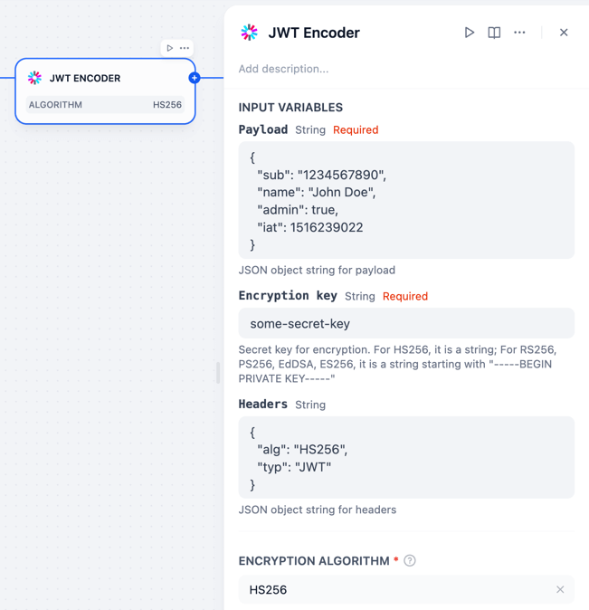

## JWT

**Author:** [bowenliang123](https://github.com/bowenliang123)
**Github Repository:** https://github.com/bowenliang123/jwt

### Description

This plugin provides tools to encode and decode JSON Web Tokens (JWT) as defined in [RFC 7519](https://tools.ietf.org/html/rfc7519).

JSON Web Token (JWT) is an open standard (RFC 7519) that defines a compact and self-contained way for securely transmitting information between parties as a JSON object. This information can be verified and trusted because it is digitally signed. JWTs can be signed using a secret (with the HMAC algorithm) or a public/private key pair using RSA or ECDSA.

As using the `PyJWT` library for implementation, this plugin supports the following algorithms: HS256, RS256, PS256, EdDSA, ES256.
For further usage in the combination of algorithm and keys, please refer [PyJWT's usage docs](https://pyjwt.readthedocs.io/en/stable/usage.html).

### Usage

- JWT Encoder

- JWT Decoder

When the option `Extract headers to _headers field` is set to `Yes`, the headers are extracted from JWT and will be put into `_header` field of the output JSON object.

